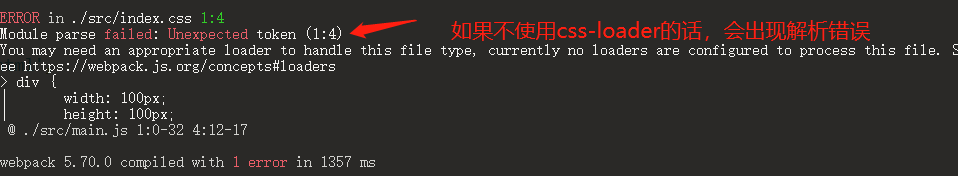

# webpack中自定义loader和plugin

>  本项目初衷是为了学习下webpack中loader和plugin的实现原理

## 1、搭建环境

基于webpack@4来实现

1、安装webpack依赖包

```shell
npm install webpack webpack-cli webpack-dev-server -D
```

2、安装html-webpack-plugin插件

这个插件的作用是：

* 1、将html加载到内存中
* 将打包出的出口文件(script)自动加载到html中

```shell
npm install html-webpack-plugin@4 -D
```

3、安装 `style-loader` 、`css-loader`

​	安装这两个插件的目的是为了看下这两个插件是如何工作的，我们如何实现一个简易版的`style-loader` 、`css-loader`

```shell
npm install style-loader css-loader -D
```

​	先说结论：

​	**`css-loader`:** 将js中引入的css文件，转化为js对象；但是并不会挂载到页面上，要使用`style-loader`挂载到页面上

​	**`style-loader`:** 处理`css-loader`生成的js对象，并生成对应的style标签，将style标签挂载到页面上

4、初始化项目

新建一个目录，然后执行下面命令初始化项目

```shell
npm init -y
```

项目目录

```
├── public
│   └── index.html
├── src
│   ├── index.css
│   └── main.js
├── package.json
└── webpack.config.js
```


5、创建`webpack.config.js`配置文件

在项目根目录下，创建`webpack.config.js`

```js
const path = require('path')
const HtmlWebpackPlugin = require('html-webpack-plugin')
module.exports = {
	mode: 'development',
	entry: {
		main: path.resolve(__dirname, './src/main.js')
	},
	output: {
		path: path.resolve(__dirname, './dist'),
		filename: 'js/[name].[hash:8].js'
	},
	module: {
		rules: []
	},
	plugins: [
		new HtmlWebpackPlugin({
			template:  'public/index.html',
			filename:  'index.html'
		})
	],
	devServer: {
		port: 9005,
		host: '0.0.0.0'
	}
}
```

6在`package.json`中配置`scripts`命令

```json
{
    "scripts": {
        "build": "webpack --config webpack.config.js",
        "start": "webpack-dev-server --config webpack.config.js"
      },
}
```


## 2、自定义loader

### 2.1、先看下css-loader和style-loader工作原理

首先在`index.css`文件中写入css代码

```css
div {
	width: 100px;
	height: 100px;
	background-color: pink;
}
```

在入口文件`mian.js`中引入

```js
import style from  './index.css'
console.log('123')

console.log(style)
```


执行运行命令

```shell
npm run start
```

会出现下面报错



> 出现上面报错原因是：webpack默认只能识别和打包js文件，对其他的文件不能识别；要想扩展webpack识别和打包其他文件，需要使用对应的loader，让webpack拥有识别和打包其他文件的能力

**使用css-loader打包css文件**

首先在webpack.config.js中配置loader

```js
{
    ...
    module: {
		rules: [
			{
				test: /\.css$/,
				use: [
					{
						loader: 'css-loader'
					}
				]
			}
		]
	}
    ...
}
```

配置好之后，再进行执行运行命令

```shell
npm run start
```


**使用style-loader将处理`css-loader`生成的js对象，并生成对应的style标签，将style标签挂载到页面上**

添加`style-loader`配置

```js
{
    ...
    module: {
		rules: [
			{
				test: /\.css$/,
				use: [
					{
						loader: 'style-loader'
					},
					{
						loader: 'css-loader'
					}
				]
			}
		]
	}
    ...
}
```

配置好之后，再进行执行运行命令

可以看到样式已经挂载到页面上了


我们如果不使用`style-loader`的情况下，是否能实现，将`css-loader`生成的js对象挂载到页面上？

来试一下：

首先将`style-loader`给去掉

```js
{
    ...
    module: {
		rules: [
			{
				test: /\.css$/,
				use: [
					{
						loader: 'css-loader'
					}
				]
			}
		]
	}
    ...
}
```

在main.js中加入以下代码

```js
import style from  './index.css'
console.log('123')

console.log(style)

// 改造代码, 将css文件显示到页面上
const styleEle = document.createElement('style')
styleEle.innerHTML = style[0][1]
document.head.appendChild(styleEle)
```

可以看到，我们不使用`style-loader`，使用我们自己定义的标签也能实现将css内容挂载到页面上


### 2.1、自定义css-loader

我们可以实现一个简易版的`css-loader`，取名`mycssLoader`

在项目根目录下新建`/myLoaders/mycssLoader.js`

```js
// loader-utils 是webpack提供的工具类
const { getOptions, stringifyRequest, parseString, parseQuery, getCurrentRequest } = require('loader-utils')
module.exports = function (source) {
	const options = getOptions(this); // 获取options参数
	const list = []
	const path = this._module.resourceResolveData.relativePath // 解析文件相对路径
	list.push([path, source], options)
	return `export default ${JSON.stringify(list)}` // 加上export default后可以使用 import xxx from xxx 获取
    // return this.callback(null, `export default ${JSON.stringify(list)}`) 等同于上面的
}
```

#### 2.1.1、在webpack中配置自定义loader

方式一：

如果你不想取别名，还想直接使用loader，那么就定义一下loader的查找位置。loader默认会先从node_modules中查找。如果我们希望它也能够到本地查找，那么就定义一下查找位置

```js
{
    resolveLoader: {
		modules: ['./node_module', './myLoaders'], // 加载loader，注意这种方式node_module也要写上
         /* 支持取别名
         alias: {
          "a-loader": path.resolve(__dirname, "src/myLoaders/mycssLoader.js"),
         }
         */
	},
	module: {
		rules: [
			{
				test: /\.css$/,
				use: [
					{
						loader: 'mycssLoader', // 使用loader
						options: {
							name: 'larry'
						}
					}
				]
			}
		]
	},
}
```

方式二：

```js
{
    module: {
		rules: [
			{
				test: /\.css$/,
				use: [
					{
						loader: path.resolve(__dirname, './myLoaders/mycssLoader.js'), // 使用自动以loader
						options: {
							name: 'larry'
						}
					}
				]
			}
		]
	}
}
```

#### 2.1.2、自定义loader函数介绍

基本用法

```js
module.exports = function (source) {
	// return this.callback(null, `export default ${JSON.stringify(list)}`)
	return `export default ${JSON.stringify(list)}`
}
```

注意：

* 1、module.exports导出的函数不能识箭头函数，因为箭头函数没有this，而loader函数的this指向的是webpack
* 2、loader函数只接受一个`source`参数，这个参数是**字符串**或者是**二进制数据**
* 3、函数的返回值是**字符串**或者是**二进制数据**
* 4、返回单个值可以直接返回就行，如果要返回多个值则需要使用`this.callback`函数返回

callback支持一下参数

```js
callback({
    // 报错
    error: Error | Null,
    // 转换后的内容
    content: String | Buffer,
    // 转换后的内容得出的sourceMap
    sourceMap?: SourceMap,
    // ast
    abstractSyntaxTree?: AST 
})
```

* 5、获取loader的options可以使用`this.query` 或者webpack提供的`loader-utils`工具类的`getOptions`方法获取
* 6、我们可以在返回值前面加上 `export default` 关键字，我们就可以通过 `import xxx from xxx`获取了

#### 2.1.3、测试自定义loader

我们在上面实现了自定义`mycssLoader`；并且在main.js引入并打印了style

```js
import style from  './index.css'
console.log('123')

console.log(style)
```

先运行下看下效果


可以看出我们自定义的loader能够正常工作并输出

我们看下编译之后的结果

```js
"use strict";
eval("__webpack_require__.r(__webpack_exports__);\n/* harmony export */ __webpack_require__.d(__webpack_exports__, {\n/* harmony export */   \"default\": () => (__WEBPACK_DEFAULT_EXPORT__)\n/* harmony export */ });\n/* harmony default export */ const __WEBPACK_DEFAULT_EXPORT__ = ([[\"./src/index.css\",\"div {\\r\\n\\twidth: 100px;\\r\\n\\theight: 100px;\\r\\n\\tbackground-color: pink;\\r\\n}\"],{\"name\":\"larry\"}]);\n\n//# sourceURL=webpack://customLoaderAndPlugin/./src/index.css?");
```

我们我们处理后的**字符串结果**，编译在入口文件中，并且使用`eval()`函数包裹；这就意味着；我们返回的字符串最终会转为js代码来使用

### 2.2、实现自定义style-loader

有了上面的经验，我们实现`style-loader`应该是很简单的事了

首先明确`style-loader`的作用是：处理`css-loader`将css编译成为js对象，并创css挂载到页面上；

开始编写：

步骤同上，创建`/myLoaders/mystyleLoader.js`文件

配置webpack，加入`mystyleLoader`

```js
{
    resolveLoader: {
		modules: ['./node_module', './myLoaders']
	},
	module: {
		rules: [
			{
				test: /\.css$/,
				use: [
					{
						loader: 'mystyleLoader' // 加入loader
					},
					{
						loader: path.resolve(__dirname, './myLoaders/mycssLoader.js'),
						options: {
							name: 'larry'
						}
					}
				]
			}
		]
	},
}
```

我们先在`mystyleLoader.js`中打印下接受到的`source`

```js
module.exports = function (source) {
	console.log('source', source) 
	return ''
}
```

打印结果

```js
// source export default [["./src/index.css","div {\r\n\twidth: 100px;\r\n\theight: 100px;\r\n\tbackground-color: pink;\r\n}"],{"name":"larry"}]
```

正是我们`mycssLoader`的返回值，我们只需要对值进行处理并返回就行了

```js
const reg = /export default\s([\s\S]*)/
module.exports = function (source) {
	// 提取export default 后面的内容
	const result = source.match(reg)[1]
	const json = JSON.parse(result)
	const cssText = json[0][1]
	const res = `
		const style = document.createElement('style')
		style.innerHTML = \`${cssText}\`
		document.head.appendChild(style)
		${source}
	`
	return res
}
```


## 3、自定义plugin

### 3.1、什么是Plugin?

我们在日常开发中，可能会用到很多插件(Plugin)，但是我们可能很少去仔细地思考什么是插件。用官方的话来说：插件(Plugin)是webpack的支柱功能，webpack自身就是构建于插件之上(说了等于没说)。平常我们的理解就是插件是用于处理webpack在编译过程中的某个特定任务的功能模块。更加通俗地理解：Plugin就是在webpack编译的**某个阶段**专注于**实现某个功能**。这就涉及到Plugin的两个重点： 1. **阶段。**也就是说它需要插入webpack的某个阶段。 2. **实现某个功能。**也就是说它需要再这个阶段做一些事情。而这个事情是我们编写插件的人确定的。你想要实现某个功能就去实现一个插件。 这样的话，大家可能就更加容易理解插件(Plugin)了。

### 3.2、webpack的编译阶段

在上面的介绍中，我们知道插件需要插入到webpack编译的某个阶段，那到底有多少个编译阶段了，这就需要用到我们在之前的阅读源码的文章中了解到的webpack的常见阶段。


插件原则上是可以作用于webpack编译的整个阶段。但是通常我们会在以下几个重要阶段进行插入：

1. **编译阶段：**

| 钩子         | 说明                         |
| ------------ | ---------------------------- |
| compile      | 编译启动                     |
| compilation  | 编译（常用）                 |
| make         | 正式开始编译，编译的核心过程 |
| afterCompile | 结束编译                     |

**2. 输出阶段**

| 钩子      | 说明                        |
| --------- | --------------------------- |
| emit      | 输出编译后的文件（常用）    |
| afterEmit | 输出编译后的文件（常用）    |
| done      | webpack所有过程完成（常用） |

**其中，`compilation`，`emit`和`done`又是最常用的三个阶段。**

### 3.3、如何实现一个Plugin?

在webpack官网中[writting a Plugin](https://link.zhihu.com/?target=https%3A//webpack.js.org/contribute/writing-a-plugin/)描述了如何去实现一个类：

1. 编写一个具名的函数或者类。
2. 在函数或者类身上定义一个apply方法。
3. 注入一个事件钩子。
4. 处理webpack内部实例身上的特定数据。(compilation)。
5. 功能完成之后，调用wbepack提供的回调。

接下来我们就按照它的描述一步一步由浅及深地去实现：

**步骤1、创建一个类**

正如我们在上面所理解的那样，Plugin需要实现特定的功能，因此它可能是一个函数或者类。这里我们使用类来创建Plugin。

```js
class MyPlugin{
    // 插件内容
}
```

**步骤2、在类上实现一个apply的方法**

Plugin比较奇特的一点是必须创建一个apply方法，Plugin插件的核心实现都在这个apply方法身上。我们可以从源码中去查看为什么一定要实现一个apply方法。我们可以看下`webpack`中源码中Plugin部分，如下所示：

```js
if (Array.isArray(plugins)) {
    for (const plugin of plugins) {
        plugin.apply(childCompiler);   // 调用apply方法
    }
}
```

我们可以看到，如果plugins是一个数组(这就是为什么我们在`webpack.config.js`中需要定义plugins成一个数组)，然后会遍历这个数组，**对数组的每个元素，也就是每个插件，调用它的apply方法并传入compiler对象。这就是为什么所有编写的插件都必须有一个apply方法，而且传入了compiler对象作为apply方法的参数**。因此，我们也需要定义一个apply方法。

```js
class MyPlugin{
    apply(compiler){
        // 功能实现
    }
}
```

**步骤3、注入一个事件钩子**

我们反复提到Plugin需要在webpack编译的某个阶段进行功能实现，因此需要注入一个钩子，用于在特定阶段进行监听。这里的所有阶段都可以通过`apply`的`compiler`参数获取到。

```js
class MyPlugin{
    apply(compiler){
        console.log(Object.keys(compiler.hooks));
    }
}
```

通过打印`compiler.hooks`，我们可以知道我们能够在哪些阶段注入钩子。

```js
[ 
  'initialize',
  'shouldEmit',
  'done',
  'afterDone',
  'additionalPass',
  'beforeRun',
  'run',
  'emit',
  'assetEmitted',
  'afterEmit',
  'thisCompilation',
  'compilation',
  'normalModuleFactory',
  'contextModuleFactory',
  'beforeCompile',
  'compile',
  'make',
  'finishMake',
  'afterCompile',
  'watchRun',
  'failed',
  'invalid',
  'watchClose',
  'infrastructureLog',
  'environment',
  'afterEnvironment',
  'afterPlugins',
  'afterResolvers',
  'entryOption' 
]
```

因此，`apply`的方法实现大致应该是这样，这里我们以done阶段为例：

```js
class MyPlugin{
    apply(compiler){
        compiler.hooks.done.tap("xxx",(stat) => {
        })
    }
}
```

其中每个阶段可能是同步的，也可能是异步的，都可以通过打印`compiler.hooks.钩子名称`来获取到，如果是同步的，那么只有一个参数`stat`，如果是异步的，那么除了有一个参数`compilation`之外，还应该有一个回调函数`callback`。也就是说：

**同步Plugin的apply方法大致是这样：**

```js
class MyPlugin{
    apply(compiler){
        compiler.hooks.done.tap("xxx",(stat) => {
            console.log("stat:",stat)
        })
    }
}
```

**异步Plugin的apply方法大致是这样：**

```js
class MyPlugin{
    apply(compiler){
        compiler.hooks.emit.tapAsync("xxx",(compilation,callback) => {
            // 其他实现：
            callback();
        })
    }
}
```

**好了，其实到目前为止，我们已经实现了一个最简单的Plugin。**虽然这个Plugin并没有什么功能，因为我们并没有去实现第四步处理webpack内部实例身上的特定数据。但是我们基本上已经知道了如何去创建最简单的Plugin。至于第四步需要使用实际的例子来进行阐述。因此，看下一部分。

### 3.4、实现一个简单的Plugin之获取文件列表

在上面的介绍中，我们已经能够实现最简单的插件了，但是我们并没有实现特定的功能，因此也就没有去操作webpack内部实例身上的特定数据，但是在实际开发插件过程中，我们要实现特定功能，肯定需要去操作数据，那么如何去操作数据了，这也是官方的第四步。我们以`webpack`官网的例子为例，获取打包后的文件列表，并将其写入一个README文档中。

```js
class MyFileListPlugin{
    constructor({filename}){
        this.filename = filename;
    }
    apply(compiler){
        compiler.hooks.emit.tapAsync("MyFileListPlugin",(compilation,callback) => {
           const assets = compilation.assets;    // 看这里，看这里
           let content = `## 文件名    资源大小`;
           Object.entries(assets).forEach(([filename,statObj]) => {
             content += `\n ${filename}    ${statObj.size()}`;
           })
           assets[this.filename] = {            // 看这里，看这里
               source:() => {
                 return content;
               },
               size(){
                 return content.length;
               }
           }
           callback();
        })
    }
}
```

在之前，我们介绍过，在apply方法定义时，注册事件有一个回调函数，回到函数的参数是`compilation`:

```js
class MyPlugin{
    apply(compiler){
        compiler.hooks.emit.tapAsync("xxx",(compilation,callback) => {
            // 其他实现：
            console.log("compilation:",compilation)
            callback();
        })
    }
}
```

这个`compilation`就是我们可以操作的数据，它能够获取到这个阶段最常见的数据。其中最常用的就是`compilation.assets`。看过我之前的文章[实现一个简易的模块打包器](https://link.zhihu.com/?target=https%3A//juejin.cn/post/6893809205183479822%23heading-14)的同学应该知道，assets实际上就是打包后的文件，它的组成一般是一个key:value。key值是路径，value值是每一个模块的内容。这里的`compilation.assets`下的每一个模块也是差不多：只不过它是两个函数source：文件内容和size:文件大写。

```js
assets[xxxx] = {
    source:() => {
        return content;
    },
    size(){
        return content.length;
    }
}
```

我们经常会根据xxx路径去获取到对象的source即文件内容，然后进行操作。以上面的获取文件列表为例，其核心功能实现如下：

```js
const assets = compilation.assets;    // 看这里，看这里
           let content = `## 文件名    资源大小`;
           Object.entries(assets).forEach(([filename,statObj]) => {
             content += `\n ${filename}    ${statObj.size()}`;
           })
           assets[this.filename] = {            // 看这里，看这里
               source:() => {
                 return content;
               },
               size(){
                 return content.length;
               }
           }
```

实际上就是：

1. 通过`compilaiton.assets`获取到所有的文件的内容和大小
2. 创建一个新的文件`assets[this.filename]`，这个文件也包括source和size。其中source就是要写入的文件内容，size就是文件的尺寸。

我们可以发现：其实我们的所有操作都是围绕`compilation.assets`，我们在实际的开发过程中其实也是这样，就是去操作`compilation.assets`，当然如果有更多复杂的功能，那么可能需要操作`compilation`下面的更多数据，比如`path`，`output`等。

### 3.5、实现本地启动服务之后再控制开打印启动的ip地址

新建`myPlugins/myHostPlugin.js`文件

```js
const os = require('os');
module.exports = class MyHostPlugin {
	apply (compiler) {
		// console.log(Object.keys(compiler.hooks));
		compiler.hooks.afterEmit.tap('MyHostPlugin', (stats) => {
			if (this.isDevServer()) {
				setTimeout(() => {
					console.log('\x1B[36m%s\x1B[0m', this.getIP(compiler))
				})
			}
		})
	}
	/**
	 * 获取本机ip地址
	 */
	getIPv4 () {
		const interfaces = os.networkInterfaces();
		const networkMap = interfaces.WLAN.find(network => network.family === 'IPv4' && network.address !== '127.0.0.1')
		return networkMap.address
	}
	getIP (compiler) {
		let isTrueIP = false // 是否是真IP
		let { port = 8080, host = 'localhost' } = (compiler.options.devServer || {})
		if (host === '0.0.0.0') {
			isTrueIP = true
			host = this.getIPv4()
		}
		let ip1 = isTrueIP ? `http://localhost:${port}` : ''
		return `
		  您当前的服务已运行在 http://${host}:${port}
				       ${ip1}
		`
	}
	/**
	 * 判断是不是以 webpack-dev-server 启动的
	 */
	isDevServer () {
		const argv = process.argv
		if (Array.isArray(argv)) {
			return argv[1].includes('webpack-dev-server')
		}
		return false
	}
}
```

在`webpack.config.js`中使用

```js
const MyHostPlugin = require('./myPlugins/myHostPlugin')
module.exports = {
    ...
    plugins: [
		new MyHostPlugin()
	],
    devServer: {
		port: 9005,
		host: '0.0.0.0'
	}
    ...
}
```

我们先试下`yarn start`进行打包


可以看出，在页面的尾部输出了本地服务ip地址


当执行`yarn  build`时，本地并没有输出ip地址


